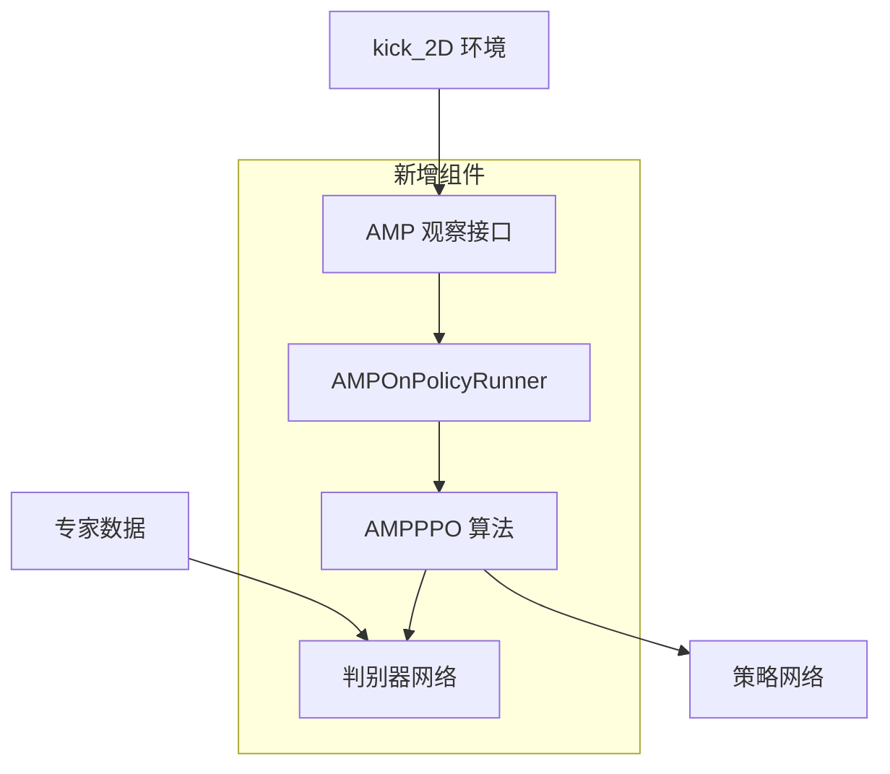
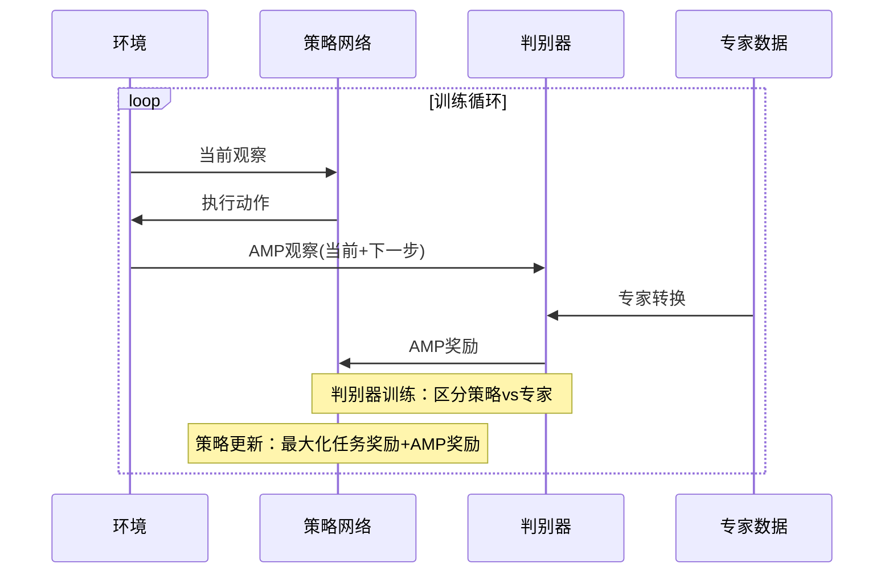

# T1机器人足球环境 AMP 集成指南

## 📋 概述

本指南详细说明如何在 `kick_2D` 环境中使用 **Adversarial Motion Priors (AMP)** 算法进行训练。AMP 是一种基于对抗学习的强化学习方法，能够让机器人学习更加自然、流畅的运动模式。

## 🏗️ 架构概览



## 📁 系统架构（V3.0 - 统一配置）

```
booster_gym/
├── envs/
│   ├── kick_2D.py          # ✅ 完整AMP功能（37维观察，AMP初始化）
│   └── kick_2D.yaml        # ✅ 统一配置文件（PPO+AMP）
├── train.py                # ✅ 智能训练脚本（自动模式切换）
├── run_train.py            # ✅ 快速启动脚本（交互式菜单）
├── create_expert_data.py   # ✅ 专家数据生成脚本
├── data/                            # 需要创建
│   └── expert_kick_data.yaml        # 专家数据文件
├── rsl_rl/
│   └── rsl_rl/
│       ├── runners/
│       │   └── amp_on_policy_runner.py    # AMP训练运行器
│       └── algorithms/
│           ├── amp_ppo.py                 # AMP PPO算法
│           └── amp_discriminator.py       # AMP判别器
└── logs/                            # 训练日志目录
    └── kick2d_amp/
```

**V3.0 新特性**：
- 🎯 **统一配置** - 单一配置文件，智能模式切换
- 🚀 **简化命令** - `--use_amp` 参数即可启用AMP
- 📋 **交互菜单** - `run_train.py` 提供友好的训练界面
- 🔧 **自动设置** - 无需手动修改配置文件
- ✅ **向后兼容** - 完全兼容原有PPO训练流程

## 🚀 快速开始

### 步骤1：准备专家数据

首先生成或准备专家动作数据：

```bash
# 方法1：使用人工设计的动作模式（推荐新手）
python create_expert_data.py --method manual --output data/expert_kick_data.yaml

# 方法2：从现有训练好的模型生成（需要先有训练好的模型）
python create_expert_data.py --method model --model path/to/your/model.pt --output data/expert_kick_data.yaml
```

### 步骤2：配置AMP参数

现在所有配置都集成在 `envs/kick_2D.yaml` 中！要启用AMP训练，**无需修改配置文件**，只需在命令行中添加 `--use_amp` 参数即可。

配置文件中的相关设置：
```yaml
# 环境配置（训练时会自动设置）
env:
  reference_state_initialization: false  # 会自动改为true（AMP模式）
  amp_motion_files: ["data/expert_kick_data.yaml"]

# 运行器配置（训练时会自动设置）
runner:
  algorithm_class_name: "PPO"            # 会自动改为AMPPPO（AMP模式）
  amp_reward_coef: 2.0                   # AMP奖励权重
  amp_task_reward_lerp: 0.3              # 30%任务奖励 + 70%AMP奖励

# 算法配置（训练时会自动设置）
algorithm:
  class_name: PPO                        # 会自动改为AMPPPO（AMP模式）
```

### 步骤3：开始AMP训练

```bash
# 普通PPO训练
python train.py --task kick_2D

# AMP训练（关键：添加 --use_amp 参数）
python train.py --task kick_2D --use_amp

# 指定训练参数
python train.py --task kick_2D --use_amp --num_envs 2048 --max_iterations 50000

# 或使用快速启动脚本
python run_train.py
```

### 步骤4：监控训练进度

训练日志将保存在指定的日志目录中，可以使用TensorBoard查看：

```bash
tensorboard --logdir=logs/kick2d_amp
```

## 📊 AMP 原理解释

### 什么是AMP？

AMP (Adversarial Motion Priors) 是一种结合了生成对抗网络(GAN)思想的强化学习算法：

1. **策略网络**：学习完成任务的动作策略
2. **判别器网络**：区分策略动作和专家动作
3. **专家数据**：高质量的参考动作序列

### AMP的优势

- ✅ **自然运动**：学习到的动作更符合物理直觉
- ✅ **样本效率**：利用专家数据加速学习
- ✅ **稳定性**：减少不自然的抖动和振荡
- ✅ **泛化性**：更好的迁移到新任务

### 训练过程



## ⚙️ 详细配置说明

### AMP核心参数

| 参数 | 默认值 | 说明 |
|------|--------|------|
| `amp_reward_coef` | 2.0 | AMP奖励的缩放系数，越大越重视动作自然性 |
| `amp_task_reward_lerp` | 0.3 | 任务奖励与AMP奖励的混合比例 |
| `amp_discr_hidden_dims` | [1024, 512] | 判别器网络隐藏层维度 |
| `amp_replay_buffer_size` | 100000 | 用于训练判别器的重放缓冲区大小 |

### 奖励组合公式

```
总奖励 = lerp × 任务奖励 + (1 - lerp) × AMP奖励
```

其中：
- `lerp = amp_task_reward_lerp`
- 任务奖励：来自环境的原始奖励（射门、接近球等）
- AMP奖励：判别器给出的动作自然性奖励

### AMP观察空间

AMP观察包含37维信息，遵循标准legged robot环境格式：

```python
AMP观察 = [
    关节位置(12) + 脚部位置(6) + 基座线速度(3) + 基座角速度(3) +
    关节速度(12) + 基座高度(1)
] = 37维
```

**注意**：AMP观察格式已优化为与标准机器人环境兼容，便于使用现有的专家数据和模型。

## 🔧 高级使用

### 自定义专家数据

你可以创建自己的专家数据格式：

```python
# 示例：从motion capture数据创建
def create_mocap_expert_data():
    expert_data = {
        'observations': [],    # 环境观察序列
        'actions': [],         # 动作序列  
        'rewards': [],         # 奖励序列
        'metadata': {
            'creation_method': 'motion_capture',
            'num_trajectories': 100,
            'avg_trajectory_length': 200.0,
        }
    }
    
    # 填充数据...
    return expert_data
```

### 调整训练策略

```yaml
# 更注重任务完成
runner:
  amp_task_reward_lerp: 0.7  # 70%任务奖励

# 更注重动作自然性  
runner:
  amp_task_reward_lerp: 0.1  # 10%任务奖励
```

### 多阶段训练

```bash
# 阶段1：专注AMP学习自然动作
python train_kick2d_amp.py --amp-config configs/amp_stage1.yaml --max-iterations 20000

# 阶段2：平衡任务和动作质量
python train_kick2d_amp.py --resume logs/stage1/model_20000.pt --amp-config configs/amp_stage2.yaml --max-iterations 30000
```

## 🆕 最新改进 (v2.0)

本版本相比初始版本进行了重要改进，更好地符合标准AMP环境接口：

### ✅ 核心改进

1. **标准化AMP观察格式**
   - 从48维优化为37维，与标准legged robot环境一致
   - 观察格式：关节位置 → 脚部位置 → 基座速度 → 关节速度 → 高度

2. **AMP初始化支持**
   - 新增 `reference_state_initialization` 配置选项
   - 实现 `_reset_dofs_amp()` 和 `_reset_root_states_amp()` 方法
   - 支持从专家数据初始化机器人状态

3. **统一接口兼容**
   - `step()` 方法统一返回AMP兼容格式
   - 移除复杂的模式切换逻辑，简化使用

4. **错误处理增强**
   - AMP数据加载失败时自动回退到普通模式
   - 详细的错误提示和调试信息

### 📋 配置变更

**新增环境配置项**：
```yaml
env:
  reference_state_initialization: true    # 启用AMP初始化
  amp_motion_files: ["path/to/data.yaml"] # 专家数据文件
```

**兼容性说明**：
- 旧版本配置文件需要添加上述环境配置项
- AMP观察维度从48改为37，需要重新生成专家数据

## 📈 性能优化建议

### 1. 专家数据质量

- ✅ **多样性**：包含不同的踢球方式和场景
- ✅ **质量**：确保专家动作是高质量的
- ✅ **数量**：通常需要几千到几万个转换
- ❌ 避免重复或低质量的动作

### 2. 超参数调优

**判别器学习率**
```yaml
algorithm:
  learning_rate: 1.e-4  # 通常比普通PPO略低
```

**AMP奖励权重**
```yaml
runner:
  amp_reward_coef: 2.0   # 开始可以设置高一些
```

**任务奖励平衡**
```yaml
runner:
  amp_task_reward_lerp: 0.3  # 根据任务复杂度调整
```

### 3. 训练策略

1. **预训练阶段**：先用高AMP权重学习自然动作
2. **微调阶段**：逐渐增加任务奖励权重
3. **评估阶段**：定期评估动作质量和任务完成度

## 🐛 常见问题与解决方案

### Q1: 训练不收敛或效果差

**可能原因**：
- 专家数据质量差或数量不足
- AMP奖励权重设置不当
- 判别器过强或过弱

**解决方案**：
```bash
# 1. 检查专家数据
python create_expert_data.py --method manual --output data/debug_expert.yaml

# 2. 调整参数
# 降低AMP权重
amp_reward_coef: 1.0
# 或增加任务奖励比例
amp_task_reward_lerp: 0.5
```

### Q2: 动作过于保守或激进

**原因**：判别器训练不平衡

**解决方案**：
```yaml
algorithm:
  # 调整判别器更新频率
  num_learning_epochs: 3  # 减少判别器更新

runner:
  # 调整判别器网络大小
  amp_discr_hidden_dims: [512, 256]  # 简化网络
```

### Q3: GPU内存不足

**解决方案**：
```yaml
env:
  num_envs: 2048  # 减少并行环境数量

runner:
  amp_replay_buffer_size: 50000  # 减小缓冲区大小
```

### Q4: 专家数据格式错误

**检查数据格式**：
```python
import yaml
with open('data/expert_kick_data.yaml', 'r') as f:
    data = yaml.safe_load(f)
    
print(f"观察维度: {len(data['observations'][0])}")
print(f"动作维度: {len(data['actions'][0])}")
print(f"轨迹数量: {data['metadata']['num_trajectories']}")
```

## 📊 性能评估

### 评估指标

1. **任务性能**：射门成功率、球进球门的准确度
2. **动作质量**：判别器分数、动作平滑度
3. **训练效率**：收敛速度、样本效率

### 评估脚本

```bash
# 运行评估
python eval_amp_model.py --model logs/kick2d_amp/model_final.pt --episodes 100
```

### 可视化分析

```python
# 分析训练日志
import pandas as pd
import matplotlib.pyplot as plt

# 加载训练数据
logs = pd.read_csv('logs/kick2d_amp/training_log.csv')

# 绘制奖励曲线
plt.figure(figsize=(12, 4))
plt.subplot(1, 2, 1)
plt.plot(logs['iteration'], logs['task_reward'], label='Task Reward')
plt.plot(logs['iteration'], logs['amp_reward'], label='AMP Reward')
plt.legend()

plt.subplot(1, 2, 2)
plt.plot(logs['iteration'], logs['discriminator_accuracy'])
plt.title('Discriminator Accuracy')
plt.show()
```

## 🔄 迁移和部署

### 模型转换

训练完成后，可以将AMP模型用于其他环境：

```python
# 加载AMP模型
checkpoint = torch.load('logs/kick2d_amp/model_final.pt')
policy = checkpoint['model_state_dict']

# 部署到新环境
new_env = kick_2D(new_config)
new_env.set_amp_mode(False)  # 部署时关闭AMP模式
```

### 模型优化

```python
# 量化模型以减小大小
import torch.quantization as quant
model_quantized = quant.quantize_dynamic(model, {torch.nn.Linear}, dtype=torch.qint8)
```

## 📚 参考资料

1. **AMP论文**: "AMP: Adversarial Motion Priors for Stylized Physics-Based Character Control"
2. **Isaac Gym文档**: [NVIDIA Isaac Gym Documentation](https://developer.nvidia.com/isaac-gym)
3. **RSL-RL库**: [Robotic Systems Lab RL Library](https://github.com/leggedrobotics/rsl_rl)

## 💡 最佳实践

1. **数据驱动**：投入时间创建高质量专家数据
2. **渐进训练**：从简单动作开始，逐步增加复杂性
3. **定期评估**：监控任务性能和动作质量的平衡
4. **参数调优**：根据具体任务调整AMP参数
5. **可视化验证**：经常观察训练出的动作是否自然

## 🤝 贡献与支持

如有问题或改进建议，请：

1. 查看本指南的常见问题部分
2. 检查日志文件中的错误信息
3. 在项目仓库中提交Issue

---

*最后更新时间：2024年*
